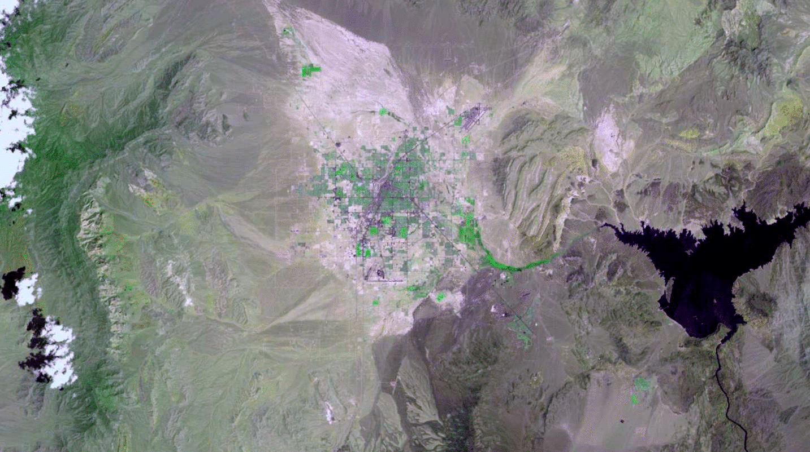

## LandsatLook Py
#### A python util to download images from the USGS Image server for a bounding box of interest.

### Install
> `pip install -r requirements.txt`

### Import Module and set parameters
> `from landsatlook import LandSatLook`

>      landsatlook = LandSatLook({
        "url":"http://landsatlook.usgs.gov/arcgis/rest/services/LandsatLook/ImageServer/",
        "output_directory":"./test",
        "image_type":"jpg",
        "bounding_box":{
        "geometry":{
            "xmax":"-12762547.271635106",
            "xmin":"-12868030.370668506",
            "ymax":"4349313.935638487",
            "ymin":"4288011.438953858",
            "spatialReference":{
                "wkid":"102100"
                }
            }
        },
        "image_size":{
            "height":"802",
            "width":"1433"
        },
        "renderingRule":{
            "rasterFunction":"Stretch",
            "rasterFunctionArguments":{
                "StretchType":3,
                "NumberOfStandardDeviations":3,
                "DRA":"true"
            },
            "variableName":"Raster"
        }
    });
`
